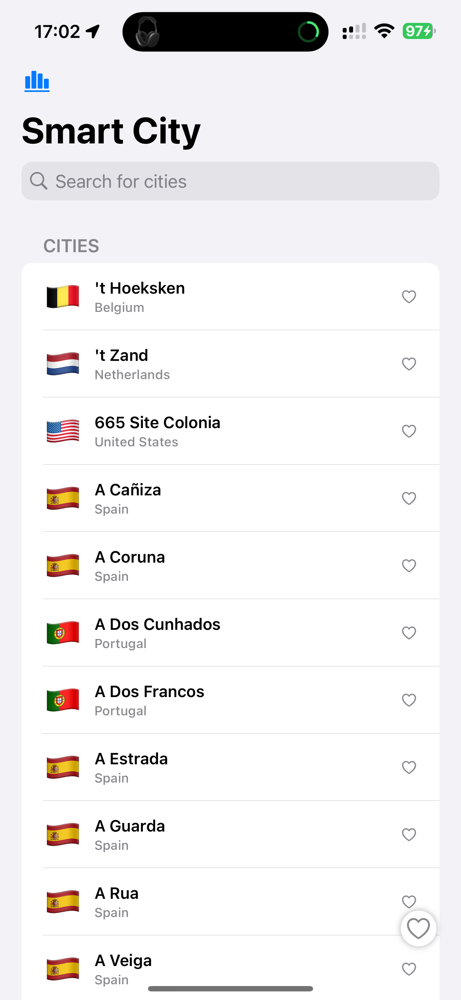
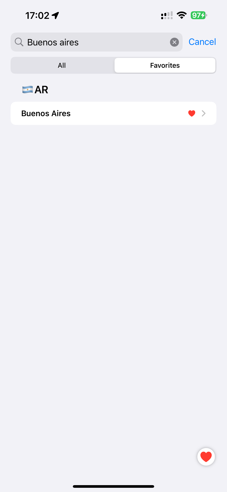
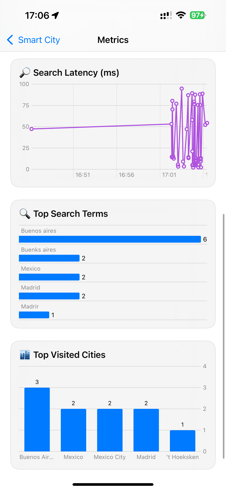

# 🚀 Smart City – Mobile Technical Lead Challenge (iOS)

This project is a solution to the technical challenge for the **Mobile Technical Lead** role at **Ualá**.  
The goal is to allow users to explore and search for cities using an interactive map, optimizing both the user experience and codebase quality.

---

## 📱 Feature Overview

Smart City Exploration allows users to:

- Search among **200,000+ cities** using real-time prefix filtering
- Dynamically update results as users type or delete
- View cities on a **MapKit-powered map**, with zoom and annotations
- Mark favorite cities and persist them across sessions
- Enjoy a responsive UI that adapts to device orientation and size

---

## 🧱 Technical Highlights

- **Clean Architecture** strictly following SOLID principles
- Modular design using `UseCase`, `Repository`, and `DataSource` layers
- **SwiftData** used for persistence of favorites and recent queries
- **Amplitude + Local Metrics Adapter** for tracking behavior
- CI pipeline with **SwiftLint**, **SwiftFormat**, and **unit testing**
- Fully responsive layout with `NavigationSplitView` and `CompactLandscapeView`
- Built with **Swift 6**, **SwiftUI**, targeting **iOS 18+**

---

### 📸 App UI Showcase

> Here's a visual walkthrough of the Smart City iOS experience:

| 🔍 Search | 📌 Detail | 🗺️ Landscape | ⭐ Favorites |
|----------|-----------|--------------|--------------|
|  |  |  |  |

| 💳 Swipe | 🔄 Toggle | 🧾 Info Card | ⌛ Debounce |
|----------|-----------|--------------|--------------|
|  |  |  |  |

| 📊 Metrics | 🧭 Split Favorites |
|------------|-------------------|
|  |  |

---

## ⚙️ Completed Features

This implementation includes:

- ✅ Modular architecture using Clean Architecture principles
- ✅ `City` domain modeling with prefix index for optimized search
- ✅ In-memory and remote loading of 200K+ cities from JSON
- ✅ Local persistence with SwiftData for favorites and recents
- ✅ Real-time prefix-based search with debounce and slicing
- ✅ Fully reactive UI built with SwiftUI
- ✅ Favorites system with star indicators and flag support
- ✅ Interactive `MapKit` view to visualize selected cities
- ✅ Metrics system with load time, latency, top searches & visits
- ✅ Adaptive UI with `CompactLandscapeView` and `NavigationSplitView`
- ✅ Unit & integration testing with fixture support

---

## 🧪 Testing Strategy

The project includes comprehensive testing coverage:

- ✅ Unit tests for core use cases (e.g. search, favorites, metrics)
- ✅ `MockCityRepository` for isolated ViewModel testing
- ✅ ViewModel + SwiftUI snapshot testing
- ✅ SwiftData persistence tests for favorites

> See [TESTING.md](docs/testing.md) for complete test plan and implementation details.

---

## 📈 Product Success Observability

To ensure the success and usability of the Smart City feature, the following **key metrics** are tracked using a custom adapter to Amplitude:

- ⏱️ **Search latency** – Time to get search results after input
- ❤️ **Favorited cities count** – Track user engagement
- 🌍 **Most searched cities** – Identify geographic interest
- 🧭 **Visited city IDs** – Capture which cities are tapped/viewed
- 📊 **Session duration** – Time spent interacting with the feature

> Full details in [OBSERVABILITY.md](docs/observability.md)

---

## 🧰 Code Quality & Tooling

This project enforces strict code quality using:

- **SwiftLint**: Linting rules and analyzer-level validations on build
- **SwiftFormat**: Auto-formatting via pre-commit hook and GitHub Actions
- **CI/CD Pipeline**: Lint → Format → Test → Build steps on every PR

#### 🔧 Local Setup

```bash
brew install swiftlint swiftformat
swiftlint version
swiftformat --version
bash run-swiftlint.sh
swiftformat .
```

> See [CI_CD.md](docs/ci_cd.md) for full setup, log structure, and Git hooks.

---

## 📚 Documentation Index

| Topic | Description |
|-------|-------------|
| [ARCHITECTURE.md](docs/architecture.md) | 📐 Describes the overall system architecture using Clean Architecture and SOLID principles, with diagrams and flow details |
| [MODULES.md](docs/modules.md) | 📦 Lists and explains each app module: Search, Favorites, Metrics, Detail, Coordinator, Summary, etc. |
| [STYLE_GUIDE.md](docs/style_guide.md) | ✍️ Coding conventions, SwiftLint rules, PR process, and naming standards |
| [PERFORMANCE.md](docs/performance.md) | ⚡ Covers optimizations for search latency, async loading, and debounce strategies |
| [FAVORITES.md](docs/favorites.md) | ❤️ Shows how favorite cities are selected, persisted using SwiftData, and integrated into the search experience |
| [WIKIPEDIA_INTEGRATION.md](docs/wikipedia_integration.md) | 📚 Explains how Wikipedia summaries are fetched and rendered for each selected city |
| [NAVIGATION.md](docs/navigation.md) | 🗺️ Explains the use of `AppCoordinator`, `NavigationStack`, `NavigationSplitView`, and `CompactLandscapeView` |
| [OBSERVABILITY.md](docs/observability.md) | 📊 Explains how metrics are captured via `AmplitudeMetricsAdapter` and persisted locally using `MetricsRecording` |
| [TESTING.md](docs/testing.md) | 🧪 Describes the testing strategy for view models, repositories, use cases, and fixtures used |
| [IMPLEMENTATION_STRATEGY.md](docs/implementation_strategy.md) | 🚀 Outlines the platform stack, team workload distribution, and quality assurance processes |
| [CI_CD.md](docs/ci_cd.md) | 🧹 Details the GitHub Actions pipeline: linting, formatting, building, testing, and deployment checks |
| [DELIVERY.md](docs/delivery.md) | 🚚 Documents the rollout strategy using TestFlight, environment toggles, and phased deployment |

---


## 🛠 Setup Instructions

> Requirements: macOS Sonoma+, Xcode 16+, Swift 6, iOS 18 SDK

```bash
# Clone the repo
git clone https://github.com/your-username/Smart-City.git
cd Smart-City

# Open in Xcode
xed .
```

---

## ▶️ Running the App

- Open the `Smart City` scheme
- Run on iPhone 15 Pro or iPad simulator
- Use the search bar to explore and tap results to view on map

---

## 🧪 Running Tests

```bash
xcodebuild test -scheme "Smart City" -destination 'platform=iOS Simulator,name=iPhone 16'
```

---

## 📬 Contact

For questions or feedback:
- 📩 iOS: jclugardo@icloud.com

_Developed by **Juan Carlos Lugardo** as part of the recruitment process for Ualá's Mobile Technical Lead position._


