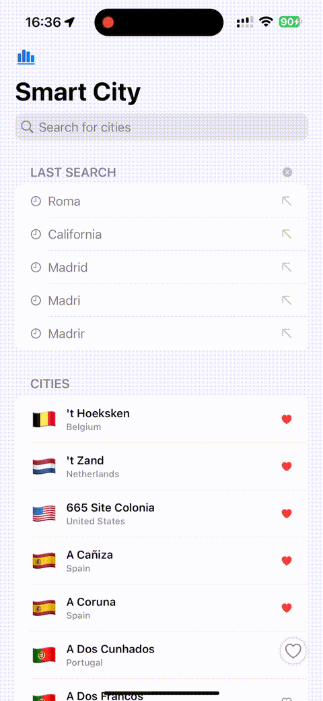

# ⚡️ PERFORMANCE.md – Smart City

This document describes the performance optimizations implemented in the Smart City app, focusing on search latency, debouncing, pagination, memory efficiency, and responsiveness in SwiftUI.

---

## 🔎 Search Latency Optimization

### ✅ In-Memory Search

All cities are loaded into memory at runtime via `InMemoryCityRepository`, which eliminates costly I/O and persistent fetches.

- The repository uses a **prefix-based index** to quickly narrow down queries.
- Cities are sorted and grouped on load for fast lookup.
- Avoids querying SwiftData on each search interaction.

### ✅ Pagination

- The UI only renders the top N (e.g. 20) results to avoid loading 200k cities at once.
- ViewModel slices the results into pages to minimize SwiftUI rendering cost.

---

## ⏳ Debounce Strategy

To reduce CPU usage and avoid firing the search use case on every keystroke, a debounce is implemented **inside the ViewModel**, avoiding any debounce logic in SwiftUI views.

```swift
var query: String = "" {
    didSet { scheduleDebouncedSearch() }
}
```

- Debounce time: `250ms`
- Debouncing is handled within `scheduleDebouncedSearch()`
- Prevents unnecessary recomputation and isolates logic from the view layer

---

## 📉 Memory Efficiency

- Cities are kept in-memory but optimized with indexing (`[String: [City]]`)
- Only the current result slice and favorites are bound to UI
- SwiftData is **not queried reactively** during searches

---

## 🗺️ Map & Detail Optimization

- The map is only rendered after `CityDetailView` is pushed
- Detail markers (`showDelayMarker()`) use `DispatchQueue.main.asyncAfter` to reduce initial cost
- City summaries (`CityInfoCard`) are lazy-loaded via `CitySummaryRepository`

---

## ✅ Summary

Smart City optimizes performance through:

- Indexed in-memory search (0 I/O latency)
- Debounce logic (250ms) for query changes
- Lightweight SwiftUI rendering via pagination
- Deferred detail rendering and lazy summaries

This ensures a smooth and reactive user experience, even with datasets of 200k+ entries.

---

### 🎥 Demo Preview

 

> Demonstrates the full app flow from cold start  

### 🎥 Search Optimization in Action



> Demonstrates fast and smooth prefix-based search using debounce  
